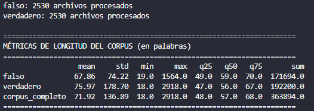
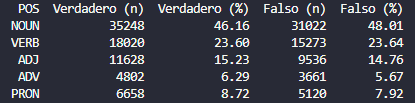

### 1. Creacion del corpus
El corpus se creo mediante web scrapping de sitios como bbc y colombian check, el corpus exisistente que se selecciono fue el de kaggle llamado spanish political fake news
- Granulariodad en las fuentes, la primera fuente tiene una mayor longitud que la segunda, se tuvo que concatenar el texto con la descripcion
- Para el calculo de las metricas tokenice la infomracion con nltk en lugar de hacer .split, nltk toma palabras + puntuacion (tokens brutos)

Resultado de las metricas: 

### 2. Preprocesamiento
Para lograr reducir el ruido de los datos y evitar que afecten de forma negativa se aplicaron las funciones 

- Tabla de frecuencias pos tagging

- grafico de barras

- top 10 de cada categoria en cada clase
Top 10 NOUN - VERDADERO
      NOUN  frecuencia
       año         393
   partido         346
presidente         310
     líder         204
      caso         198
       ley         194
   acuerdo         190
  elección         187
       día         181
    medida         162

Top 10 NOUN - FALSO
      NOUN  frecuencia
   partido         421
      vers         413
presidente         331
       año         284
     líder         241
       ley         195
  elección         192
 formación         192
   acuerdo         189
       ver         176

Top 10 VERB - VERDADERO
    VERB  frecuencia
   tener         483
   hacer         439
   pedir         320
   decir         292
     dar         204
asegurar         201
 afirmar         182
     ver         182
  querer         160
  llegar         147

Top 10 VERB - FALSO
     VERB  frecuencia
    tener         397
    hacer         322
    pedir         295
    decir         244
 asegurar         201
      dar         199
presentar         171
   querer         134
 anunciar         133
    dejar         128

Top 10 ADJ - VERDADERO
       ADJ  frecuencia
     nuevo         264
   primero         229
  político         159
    último         154
   público         142
   general         130
 electoral         121
   próximo         118
    social         109
autonómico          94

Top 10 ADJ - FALSO
       ADJ  frecuencia
     nuevo         273
  político         187
   primero         165
   público         151
 electoral         145
   general         140
    último         116
    social         114
   próximo         112
socialista          89

- existen diferencias gramaticales??

- Analisis de postagging
-- Se encontro el sustantivo vers concurrentemente en las noticias falsas pero esto es debido a que el dataset es sintetico, generado con webscrapping automatizado y aumentado.
[vers] -> habría delito en que el Iniciativa vers per Catalunya destruyese su propia
[vers] -> El Iniciativa vers per Catalunya sigue los pasos
[vers] -> al límite con presupuestos del Iniciativa vers per Catalunya prorrogados. Que
[vers] -> tres autobuses contra EQUO, Iniciativa vers per Catalunya y EQUO.
[vers] -> El EQUO y el Iniciativa vers per Catalunya de Alcorcón denuncian
[vers] -> , además, que el Iniciativa vers per Catalunya usó un espacio
[vers] -> para los socialistas. El Iniciativa vers per Catalunya lo desmiente y
[vers] -> El Iniciativa vers per Catalunya cede la Alcaldía
[vers] -> consigue con el apoyo del Iniciativa vers per Catalunya el sillón de
[vers] -> Dimite la líder del Iniciativa vers per Catalunya de Vigo y
[vers] -> tome ahora las riendas del Iniciativa vers per Catalunya de Vigo hasta
[vers] -> su llegada al liderazgo del Iniciativa vers per Catalunya, se ha
[vers] -> '. El líder del Iniciativa vers per Catalunya se ha dirigido
[vers] -> con estos comicios es el Iniciativa vers per Catalunya, al que
[vers] -> partidos, Coalición Canaria, Iniciativa vers per Catalunya, EQUO y
Se encontraron 15 ocurrencias de 'vers' o 'ver' como sustantivo en noticias falsas.

- El porcentaje relativo de la distribucion de las estiquetas gramaticales entre las principales entidades es inferior al 20% esto indica que no se estan tomando en cuenta las demas estructuras gramaticales, lo cual no indicaria un fallo pero s    i indica el enfoque del modelo 