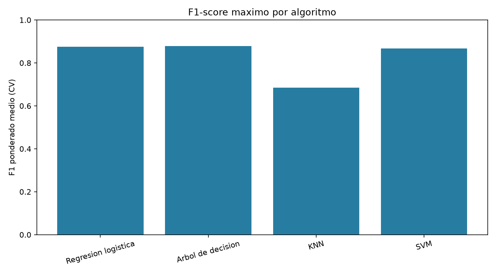
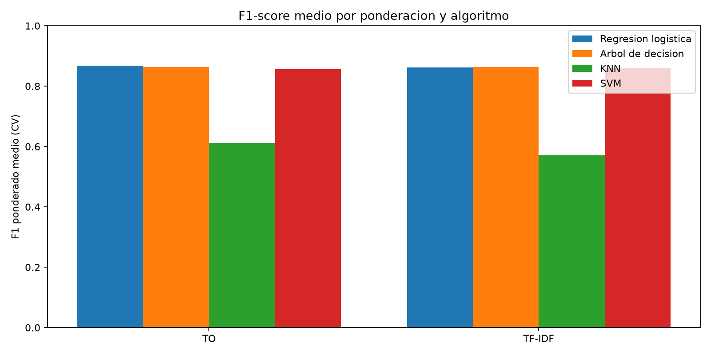
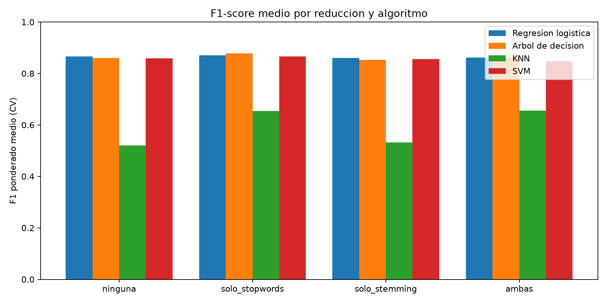

# Punto 10 | Clasificación de noticias

> Comparación de cuatro clasificadores, dos esquemas de ponderación y cuatro variantes de preprocesamiento. La métrica de referencia es el F1 ponderado.

## Diseño experimental

**Corpus:** 5200 documentos, 2600 verdaderos y 2600 falsos. **Evaluación:** partición estratificada 80/20 y validación cruzada estratificada de 10 folds sobre entrenamiento. Las métricas de CV se presentan como media; para F1 también se muestra la desviación estándar.

## Vista general

## Resultados por algoritmo

Accuracy es la proporción de aciertos; precisión, recall y F1 se calculan con promedio ponderado por clase. Cada tabla contiene las ocho configuraciones en el mismo orden de la guía.

### Regresion logistica

**Validación cruzada (10 folds)**

| # | Ponderación | Stopwords | Stemming | Accuracy | Precisión ponderada | Recall ponderado | F1 ponderado |
|---:|---|:---:|:---:|---:|---:|---:|---:|
| 1 | TO | No | No | 86.97% | 87.25% | 86.97% | 86.95% ± 1.73% |
| 2 | TO | Sí | No | 87.60% | 87.94% | 87.60% | 87.57% ± 1.46% |
| 3 | TO | No | Sí | 86.06% | 86.41% | 86.06% | 86.02% ± 1.26% |
| 4 | TO | Sí | Sí | 86.47% | 86.72% | 86.47% | 86.44% ± 1.59% |
| 5 | TF-IDF | No | No | 86.37% | 86.53% | 86.37% | 86.35% ± 1.67% |
| 6 | TF-IDF | Sí | No | 86.63% | 86.78% | 86.63% | 86.62% ± 1.78% |
| 7 | TF-IDF | No | Sí | 86.08% | 86.24% | 86.08% | 86.07% ± 1.67% |
| 8 | TF-IDF | Sí | Sí | 85.82% | 85.95% | 85.82% | 85.80% ± 2.10% |

**Conjunto de prueba (20%)**

| # | Ponderación | Stopwords | Stemming | Accuracy | Precisión ponderada | Recall ponderado | F1 ponderado |
|---:|---|:---:|:---:|---:|---:|---:|---:|
| 1 | TO | No | No | 87.79% | 87.92% | 87.79% | 87.78% |
| 2 | TO | Sí | No | 88.65% | 88.77% | 88.65% | 88.65% |
| 3 | TO | No | Sí | 87.31% | 87.42% | 87.31% | 87.30% |
| 4 | TO | Sí | Sí | 87.31% | 87.32% | 87.31% | 87.31% |
| 5 | TF-IDF | No | No | 87.60% | 87.66% | 87.60% | 87.59% |
| 6 | TF-IDF | Sí | No | 87.21% | 87.26% | 87.21% | 87.21% |
| 7 | TF-IDF | No | Sí | 86.83% | 86.87% | 86.83% | 86.82% |
| 8 | TF-IDF | Sí | Sí | 86.44% | 86.45% | 86.44% | 86.44% |

### Arbol de decision

**Validación cruzada (10 folds)**

| # | Ponderación | Stopwords | Stemming | Accuracy | Precisión ponderada | Recall ponderado | F1 ponderado |
|---:|---|:---:|:---:|---:|---:|---:|---:|
| 1 | TO | No | No | 86.06% | 86.11% | 86.06% | 86.05% ± 1.38% |
| 2 | TO | Sí | No | 87.84% | 87.89% | 87.84% | 87.83% ± 0.99% |
| 3 | TO | No | Sí | 85.36% | 85.42% | 85.36% | 85.35% ± 0.82% |
| 4 | TO | Sí | Sí | 86.15% | 86.21% | 86.15% | 86.15% ± 1.37% |
| 5 | TF-IDF | No | No | 86.06% | 86.11% | 86.06% | 86.05% ± 1.38% |
| 6 | TF-IDF | Sí | No | 87.84% | 87.89% | 87.84% | 87.83% ± 0.99% |
| 7 | TF-IDF | No | Sí | 85.36% | 85.42% | 85.36% | 85.35% ± 0.82% |
| 8 | TF-IDF | Sí | Sí | 86.15% | 86.21% | 86.15% | 86.15% ± 1.37% |

**Conjunto de prueba (20%)**

| # | Ponderación | Stopwords | Stemming | Accuracy | Precisión ponderada | Recall ponderado | F1 ponderado |
|---:|---|:---:|:---:|---:|---:|---:|---:|
| 1 | TO | No | No | 85.19% | 85.19% | 85.19% | 85.19% |
| 2 | TO | Sí | No | 85.87% | 85.90% | 85.87% | 85.86% |
| 3 | TO | No | Sí | 82.98% | 83.01% | 82.98% | 82.98% |
| 4 | TO | Sí | Sí | 84.62% | 84.62% | 84.62% | 84.62% |
| 5 | TF-IDF | No | No | 85.19% | 85.19% | 85.19% | 85.19% |
| 6 | TF-IDF | Sí | No | 85.87% | 85.90% | 85.87% | 85.86% |
| 7 | TF-IDF | No | Sí | 82.98% | 83.01% | 82.98% | 82.98% |
| 8 | TF-IDF | Sí | Sí | 84.62% | 84.62% | 84.62% | 84.62% |

### KNN

**Validación cruzada (10 folds)**

| # | Ponderación | Stopwords | Stemming | Accuracy | Precisión ponderada | Recall ponderado | F1 ponderado |
|---:|---|:---:|:---:|---:|---:|---:|---:|
| 1 | TO | No | No | 58.10% | 63.41% | 58.10% | 53.34% ± 3.80% |
| 2 | TO | Sí | No | 69.59% | 77.55% | 69.59% | 67.20% ± 1.96% |
| 3 | TO | No | Sí | 59.11% | 63.44% | 59.11% | 55.49% ± 2.71% |
| 4 | TO | Sí | Sí | 70.34% | 76.62% | 70.34% | 68.50% ± 1.98% |
| 5 | TF-IDF | No | No | 56.30% | 61.87% | 56.30% | 50.86% ± 5.63% |
| 6 | TF-IDF | Sí | No | 64.23% | 65.25% | 64.23% | 63.63% ± 2.01% |
| 7 | TF-IDF | No | Sí | 56.37% | 61.68% | 56.37% | 50.98% ± 4.27% |
| 8 | TF-IDF | Sí | Sí | 64.06% | 66.44% | 64.06% | 62.70% ± 3.23% |

**Conjunto de prueba (20%)**

| # | Ponderación | Stopwords | Stemming | Accuracy | Precisión ponderada | Recall ponderado | F1 ponderado |
|---:|---|:---:|:---:|---:|---:|---:|---:|
| 1 | TO | No | No | 59.52% | 64.93% | 59.52% | 55.49% |
| 2 | TO | Sí | No | 68.17% | 74.95% | 68.17% | 65.85% |
| 3 | TO | No | Sí | 59.71% | 63.41% | 59.71% | 56.73% |
| 4 | TO | Sí | Sí | 70.48% | 76.45% | 70.48% | 68.72% |
| 5 | TF-IDF | No | No | 55.19% | 60.64% | 55.19% | 48.62% |
| 6 | TF-IDF | Sí | No | 60.87% | 60.94% | 60.87% | 60.80% |
| 7 | TF-IDF | No | Sí | 54.90% | 58.18% | 54.90% | 49.89% |
| 8 | TF-IDF | Sí | Sí | 62.31% | 63.33% | 62.31% | 61.57% |

### SVM

**Validación cruzada (10 folds)**

| # | Ponderación | Stopwords | Stemming | Accuracy | Precisión ponderada | Recall ponderado | F1 ponderado |
|---:|---|:---:|:---:|---:|---:|---:|---:|
| 1 | TO | No | No | 85.89% | 86.00% | 85.89% | 85.88% ± 1.50% |
| 2 | TO | Sí | No | 86.63% | 86.74% | 86.63% | 86.62% ± 1.54% |
| 3 | TO | No | Sí | 85.67% | 85.83% | 85.67% | 85.66% ± 1.73% |
| 4 | TO | Sí | Sí | 84.52% | 84.58% | 84.52% | 84.51% ± 2.11% |
| 5 | TF-IDF | No | No | 85.96% | 86.10% | 85.96% | 85.95% ± 2.16% |
| 6 | TF-IDF | Sí | No | 86.71% | 86.82% | 86.71% | 86.70% ± 1.39% |
| 7 | TF-IDF | No | Sí | 85.67% | 85.86% | 85.67% | 85.65% ± 1.85% |
| 8 | TF-IDF | Sí | Sí | 85.07% | 85.13% | 85.07% | 85.07% ± 2.11% |

**Conjunto de prueba (20%)**

| # | Ponderación | Stopwords | Stemming | Accuracy | Precisión ponderada | Recall ponderado | F1 ponderado |
|---:|---|:---:|:---:|---:|---:|---:|---:|
| 1 | TO | No | No | 87.02% | 87.08% | 87.02% | 87.01% |
| 2 | TO | Sí | No | 86.73% | 86.74% | 86.73% | 86.73% |
| 3 | TO | No | Sí | 85.67% | 85.68% | 85.67% | 85.67% |
| 4 | TO | Sí | Sí | 86.06% | 86.10% | 86.06% | 86.05% |
| 5 | TF-IDF | No | No | 86.83% | 86.91% | 86.83% | 86.82% |
| 6 | TF-IDF | Sí | No | 86.73% | 86.74% | 86.73% | 86.73% |
| 7 | TF-IDF | No | Sí | 85.29% | 85.30% | 85.29% | 85.29% |
| 8 | TF-IDF | Sí | Sí | 85.77% | 85.79% | 85.77% | 85.77% |

## Comparación y observaciones

La mejor configuración según F1 ponderado en validación cruzada fue **Arbol de decision** con ponderación **TO**, stopwords=True y stemming=False (F1 CV=87.83%; F1 test=85.86%).

Las gráficas resumen el máximo de F1 por algoritmo y las medias al cambiar la ponderación o las técnicas de reducción. Las tablas anteriores contienen las cuatro métricas para cada combinación, tanto en CV como en prueba.

## Archivos generados

- `metricas_modelos.csv`: métricas de validación cruzada y prueba para las 32 configuraciones.
- `f1_maximo_por_algoritmo.png`, `f1_medio_ponderacion_algoritmo.png` y `f1_medio_reduccion_algoritmo.png`: gráficas comparativas incluidas arriba.
- `configuracion_experimentos.json`: tamaños, etiquetas y parámetros de la ejecución.
